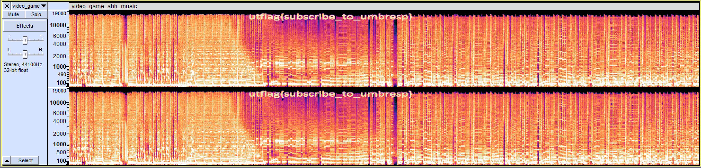

# Complextro
* **Event:** SpaceCTF (ISSS CTF 10-04-2024)
* **Problem Type:** Forensics

## Background
[Audio Steganography](https://ctf-wiki.mahaloz.re/misc/audio/introduction/)

[Spectrograms](https://en.wikipedia.org/wiki/Spectrogram)

[Audacity](https://www.audacityteam.org/)

## Exploit

A look at the metadata of the audio file reveals that the flag is not hidden there. Upon listening
to the song, you might notice some weirdness in the higher frequencies about halfway in (1:17). This
is because there is a hidden message in the form of audio frequencies. This message can be viewed by
looking at the spectrogram of the audio file:

This can be viewed using Audacity or some other audio editor or visualization tool.